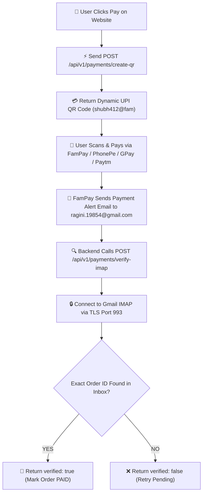

<div align="center">

  

  <br />

  [](https://github.com/shubhkumarmishra82-debug/FAMPAY_API_IMAP)
  [](LICENSE)
  [](docker-compose.yml)
  [](railway.json)

  <br />
  <br />

  <p align="center">
    <b>🔥 Standalone FamPay Dynamic UPI QR Generator & Gmail IMAP Auto-Payment Verification Microservice. Plug into ANY Website or Backend App!</b>
  </p>

</div>

---

## ⚡ Overview

`FAMPAY_API_IMAP` is a standalone, lightweight payment microservice and Node.js module that allows website developers to accept payments via **FamPay UPI** using dynamic QR codes and verify payments automatically using **Gmail IMAP** with Google App Passwords.

### Why Use This?
- ❌ **No Merchant Gateway Needed**: Skip expensive merchant onboarding fees and KYC procedures.
- ⚡ **Dynamic UPI QR Code**: Generates real-time UPI payment URIs (`upi://pay?pa=shubh412@fam&am=...&tn=ORDER_XXXXXX`).
- 🔒 **Strict IMAP Verification**: Connects to `imap.gmail.com:993` via TLS, searches incoming payment emails for the exact `ORDER_DEMON_...` ID, and confirms payment.

---

## 🔄 Architecture & Payment Flow



---

## 🛠️ Quick Start & Integration

### Option 1: Use as a Standalone REST API Server

#### 1. Clone & Install
```bash
git clone https://github.com/shubhkumarmishra82-debug/FAMPAY_API_IMAP.git
cd FAMPAY_API_IMAP
npm install
```

#### 2. Configure Environment (`.env`)
```env
PORT=4000
NODE_ENV=production

# FamPay UPI VPA
FAMPAY_UPI_ID=shubh412@fam

# Gmail Account Receiving Payment Alerts
GMAIL_USER=ragini.19854@gmail.com

# 16-Character Google App Password
GMAIL_APP_PASSWORD=yhzlqqhtsxeaoztg
```

#### 3. Start Server
```bash
npm start
```
Your payment microservice is now live at `http://localhost:4000`!

---

## 🌐 REST API Endpoints

### 1. Generate Dynamic UPI QR Code
- **Endpoint**: `POST /api/v1/payments/create-qr`
- **Headers**: `Content-Type: application/json`
- **Request Body**:
```json
{
  "amount": 999,
  "userEmail": "user@example.com",
  "note": "Pro Subscription"
}
```
- **Response**:
```json
{
  "success": true,
  "message": "FamPay Dynamic UPI QR Generated",
  "order": {
    "orderId": "ORDER_DEMON_542066",
    "vpa": "shubh412@fam",
    "amount": 999,
    "upiUri": "upi://pay?pa=shubh412%40fam&pn=DemonAPI&am=999&tn=ORDER_DEMON_542066&cu=INR",
    "qrImageUrl": "https://api.qrserver.com/v1/create-qr-code/?size=300x300&data=upi...",
    "status": "PENDING"
  }
}
```

---

### 2. Verify IMAP Email Payment
- **Endpoint**: `POST /api/v1/payments/verify-imap`
- **Headers**: `Content-Type: application/json`
- **Request Body**:
```json
{
  "orderId": "ORDER_DEMON_542066"
}
```
- **Response (When Payment Email is Present)**:
```json
{
  "success": true,
  "verified": true,
  "message": "🎉 Payment verified via Gmail IMAP! Order ORDER_DEMON_542066 marked as PAID.",
  "order": {
    "orderId": "ORDER_DEMON_542066",
    "status": "PAID",
    "paidAt": "2026-08-13T22:15:00.000Z"
  }
}
```

---

## 📦 Option 2: Use as an In-Code Library (Node.js / Express)

You can import `index.js` directly into any Node.js codebase:

```javascript
const { createDynamicUpiQr, verifyFamPayImapPayment } = require('./index');

// 1. Generate QR Code
const qr = createDynamicUpiQr({
  vpa: 'shubh412@fam',
  amount: 999,
  orderId: 'ORDER_998877'
});
console.log('QR Image URL:', qr.qrImageUrl);

// 2. Strict IMAP Verification
const isPaid = await verifyFamPayImapPayment({
  gmailUser: 'ragini.19854@gmail.com',
  appPassword: 'yhzlqqhtsxeaoztg',
  orderId: 'ORDER_998877'
});

if (isPaid) {
  console.log('🎉 Payment Confirmed!');
} else {
  console.log('❌ Payment email not found yet.');
}
```

---

## 🚀 Deployment

### Deploy to Railway
1. Push this repo to GitHub.
2. Open [Railway.app](https://railway.app/) -> **Deploy from GitHub Repo**.
3. Railway automatically detects `railway.json` and launches your microservice!

### Deploy via Docker Compose
```bash
docker compose up -d --build
```

---

<div align="center">

  <sub>Built with ❤️ by Shubh Kumar Mishra. Licensed under MIT.</sub>

</div>
